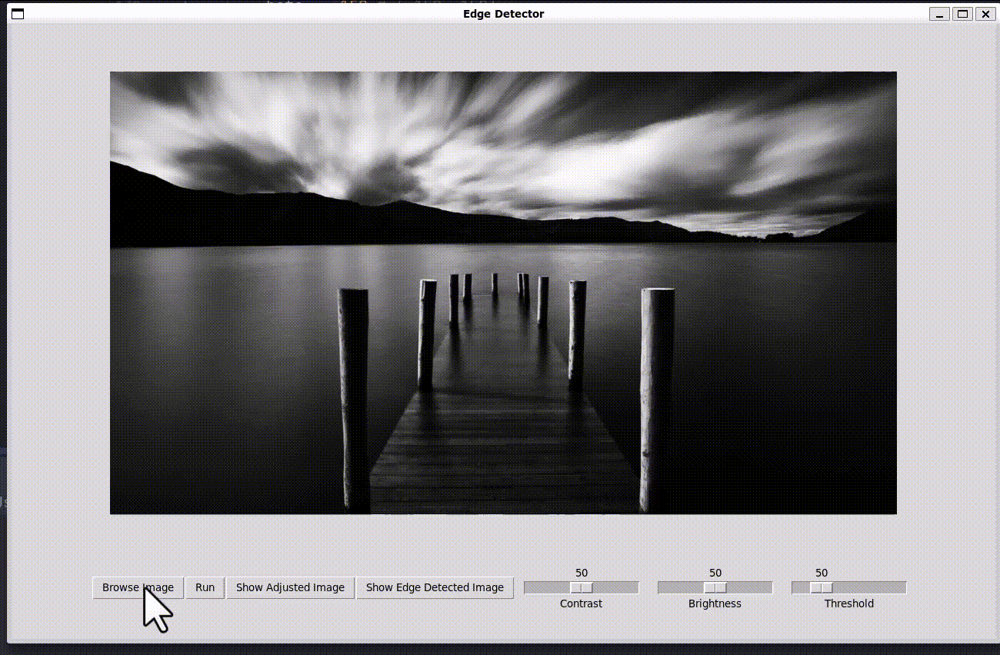

# Edge Detection Filter

## Introduction

In this project, we implemented an Edge Detection Filter based on Sobel Filter. The project’s core is based on SIMD computations using NVIDIA CUDA. The project features both CLI and GUI. The GUI is written in Python, uses the Tkinter library, and communicates with the CUDA core, which is written in C++ using a shell.

For more information regarding the implemntation and analysis of the result read `Document.pdf`.

## Run

### GUI

Run:

```bash
python GUI/main.py
```

### CLI

Compile `main.cu` in `Core`.

Run:
```bash
    ./main [image_path] [alpha] [beta] [thresh]
```

- *alpha*: Desired Contrast Value
- *beta*: Desired Brigtness Value
- *thresh*: Desired Sobel Filter Threshold

## Demo


